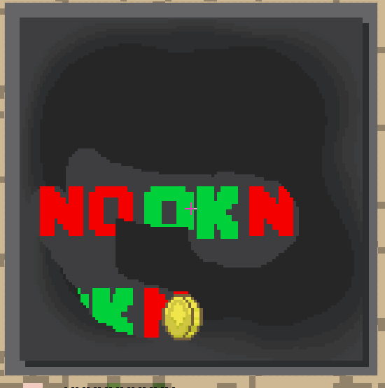

# How to create a card

## Introduction

Creating cards is very easy if you're familiar with images editing softwares, you have to know how to edit images or have a friend who can use [Photoshop](https://www.adobe.com/products/photoshop.html), [GIMP ](https://www.gimp.org/)or [Paint.net](https://www.getpaint.net/download.html).

## Creating your first card

### Step 1

To create a card you have to execute the command`/scratchit config create NAME`.  
In this example I will call my card: example, so I execute the command `/scratchit config create example`


### Step 2

A new folder with some files will then be created automatically by the plugin, you can find it here:


### Step 4

Now let's edit the card!  
You will notice some files in the new folder, they allow you to customize the minigame based on your needs.  
Open the file example.yml to edit the configurations of the card.


### Step 5

Customizing the main properties of the card:

```yaml
scratch_card:
  id: example
  permissions:
    show_in_list_gui: new_card.example
    use: new_card.example
  name: "example"
  lore:
  - '&7EDIT ME!'
  - '&7(hold right click to scratch)'
  material: PAPER
  glow: true
  needed_to_win: 3
  needed_scratch_percentage: 5
  win_chance: 30
  cursor:
    speed: 1.2
    allow_left_click: false
    pressed_sound:
      name: DIG_SAND
      volume: 3
      pitch: 0.9
      interval_ticks: 5
```

Most of the properties are self explanatory, there are some special properties tho:

* `scratch_card` : this is the type of the card \(more will be added in the future\)
* `glow`: allows you to me the item glow without enchant
* `needed_to_win`: how many "right" symbols are needed to be discovered by the player to win
* `needed_scratch_percentage`: it's the minimum scratched percentage to make the plugin show if they lose or win
* `win_chance`: it's the chance of the player to find the `needed_to_win` symbols and win
* `cursor`:
  * `speed`: speed of the cursor
  * `pressed_sound`: sound that the cursor will make while being pressed
    * `interval_ticks`: it's the interval between each sound play
  * `allow_left_click`: allows the player to press the cursor using also left click

### Step 6

Customizing the win/lose actions: this plugin allows you to create some actions on win or lose, not only giving items but also a lot of other stuff.

For example:

```yaml
  # this is the list of win actions groups, you can create a any amount you want
  win_actions: 
    win_effect_levelup_sound: # this is an example group
      always_execute: true # execute is always, ignoring chance
      execute_instantly: false # execute it after the win animation, not instantly
      play_sound_1: # play a sound, you can play as many sounds as you want
        name: "ENTITY_PLAYER_LEVELUP"
        volume: 1
        pitch: 1
      play_sound_another_sound: # play a sound, you can play as many sounds as you want
        name: "ENTITY_PLAYER_BURP"
        volume: 1
        pitch: 1
    first_group: # another actions group
      chance: 5 # chance of the action to be executed
      item_1: # this action will give an item
        name: SPONGE
        amount: 2
      send_message: # send a message to the player when this action is executed
        message: '&b{player} &awon Sponge x2 using a &bClean It! &ascratchcard!'
        broadcast: WORLD #type of the broadcast (WORLD, SERVER, PLAYER)
      play_sound_1:
        name: ENTITY_ITEM_PICKUP
        volume: 1
        pitch: 1
    second_group:
      chance: 20
      item_1:
        name: GLASS
        amount: 16
      item_2:
        name: GLASS_PANE
        amount: 16
      play_loop_sound_digging: #plays a sound in loop, 7 times (1 time each 3 ticks)
        name: "DIG_GRAVEL"
        volume: 1
        pitch: 1
        delay: 0
        interval: 3
        times: 7
      send_message:
        message: '&aYou won Glass x16 and Glass Pane x16 using a &bClean It!
          &ascratchcard!'
      command_hello: #supported placeholders: {player} {x} {y} {z} and PlaceholderAPI
        command: "tell {player} hello" 
        as_console: true
        delay: 5
```

### Step 7

Editing the graphics: you can edit the graphics as you wish! For example I will use [GIMP ](https://www.gimp.org/)to edit the files.

**background.png**

This is the shape of the card, the background.


#### overlay.png

This is the part we are going to erase using the cursor, which will reveal the background.


#### right.png and wrong.png

These are the icons shown behind the **overlay.png** file


#### eraser.png

This is a special file, it's basically the part of the cursor which can delete the **overlay.png**, this is useful if you want the cursor to erase only on the top left part and don't allow the user to remove the **overlay.png** using the whole cursor icon.

#### cursor.png

It's the cursor icon shown when the player moves the mouse.

#### pressed\_cursor.ong

It's the cursor icon shown when the player holds down right mouse button.

#### background\_lose.png and background\_win.png

These are the backgrounds shown when the user wins or loses.

#### `lose_anim` and `win_anim` folders

These are special folders and they contain the frames of the win/lose animations

### Step 8

Execute the reload command and then get the item





